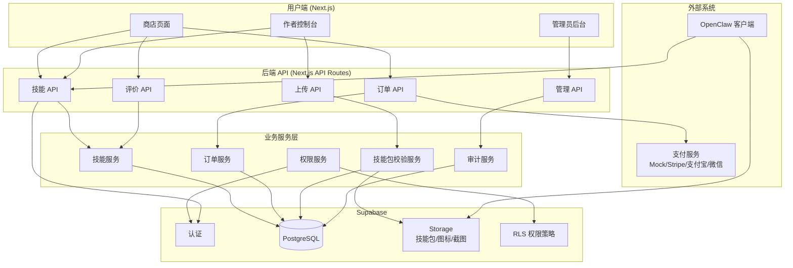
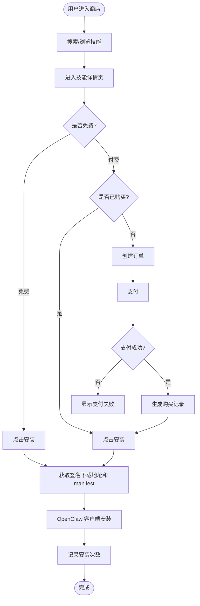
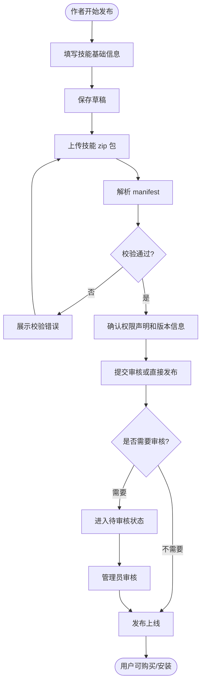
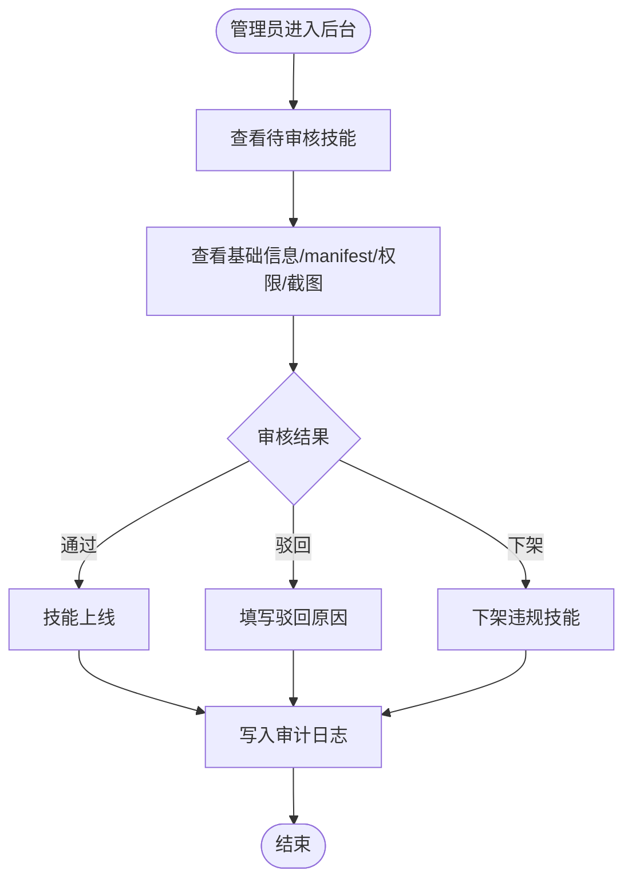
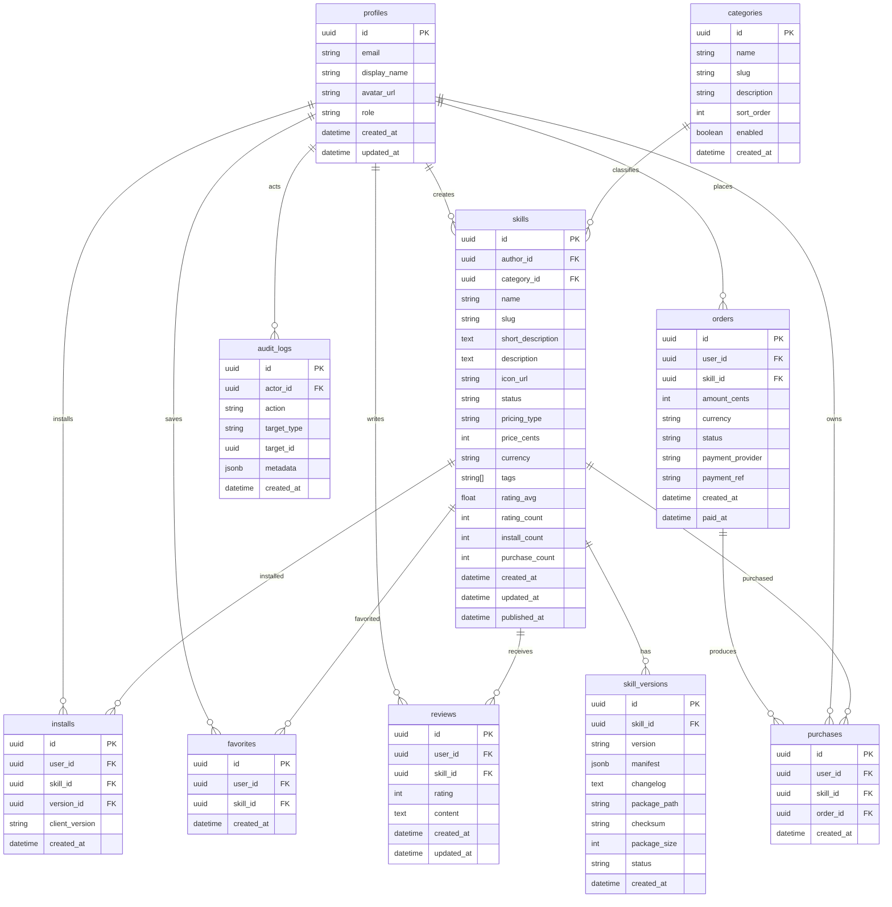
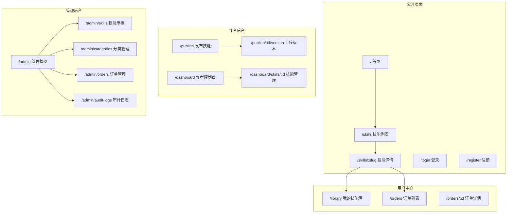

# OpenClaw Skill Shop - 架构设计文档

## 项目概述

OpenClaw Skill Shop 是一个面向 OpenClaw Skill 的线上商店应用系统。

平台支持用户浏览、搜索、购买、安装和评价技能；支持作者上传技能包、发布版本、查看安装和收入数据；支持管理员审核技能、管理分类和处理内容治理。

核心目标：

- 为 OpenClaw 用户提供可信的 Skill 发现、购买、安装入口
- 为 Skill 作者提供发布、版本管理和数据反馈能力
- 为平台管理员提供审核、分类、订单和审计管理能力

---

## 技术栈

| 层级 | 技术选型 |
|-----|---------|
| 前端 | Next.js 14+ App Router + TypeScript + Tailwind CSS |
| 后端 | Next.js API Routes / Server Actions |
| 数据库 | Supabase PostgreSQL |
| 认证 | Supabase Auth |
| 文件存储 | Supabase Storage |
| 权限 | Supabase RLS + 服务端权限校验 |
| 支付 | 开发阶段 Mock Pay，后续可接 Stripe / 支付宝 / 微信支付 |
| 技能包 | zip 包上传 + manifest 校验 |
| UI | Tailwind CSS + lucide-react |

---

## 1. 系统架构图



---

## 2. 核心业务流程

### 2.1 用户购买和安装流程



### 2.2 作者发布技能流程



### 2.3 管理员审核流程



---

## 3. 角色和权限

| 角色 | 权限 |
|-----|------|
| 游客 | 浏览公开技能、搜索、查看详情、注册登录 |
| 普通用户 | 收藏、购买、安装、评价已购买或已安装技能 |
| 作者 | 创建技能、上传版本、管理自己发布的技能、查看安装和订单数据 |
| 管理员 | 审核技能、下架技能、管理分类、查看订单和审计日志 |

权限规则：

- 未登录用户不能购买、安装付费技能、发布技能或评价
- 普通用户不能下载未购买的付费技能包
- 作者只能管理自己创建的技能
- 管理员可以审核、下架和管理所有技能
- 所有敏感操作都需要服务端再次校验权限，不能只依赖前端判断

---

## 4. 数据模型图



---

## 5. 状态设计

### 5.1 技能状态

| 状态 | 说明 |
|-----|------|
| draft | 草稿，只有作者可见 |
| pending_review | 待审核 |
| published | 已上线，用户可浏览、购买和安装 |
| rejected | 审核驳回，作者可修改后重新提交 |
| suspended | 管理员下架 |
| archived | 作者归档，不再展示新购买入口 |

### 5.2 订单状态

| 状态 | 说明 |
|-----|------|
| pending | 待支付 |
| paid | 已支付 |
| cancelled | 已取消 |
| refunded | 已退款 |
| failed | 支付失败 |

### 5.3 技能版本状态

| 状态 | 说明 |
|-----|------|
| draft | 版本草稿 |
| active | 当前可安装版本 |
| deprecated | 旧版本，不再默认安装 |
| blocked | 因安全或违规原因禁用 |

---

## 6. 页面结构



---

## 7. API 设计

### 7.1 技能 API

| 方法 | 路径 | 描述 |
|-----|------|-----|
| GET | /api/skills | 获取技能列表，支持分页、搜索、分类、排序 |
| POST | /api/skills | 创建技能草稿 |
| GET | /api/skills/:slug | 获取技能详情 |
| PATCH | /api/skills/:slug | 修改技能信息 |
| DELETE | /api/skills/:slug | 删除草稿或归档技能 |
| GET | /api/skills/:slug/versions | 获取版本列表 |
| POST | /api/skills/:slug/versions | 发布新版本 |
| GET | /api/skills/:slug/download | 获取签名下载地址 |
| POST | /api/skills/:slug/install | 记录安装并返回安装元信息 |
| POST | /api/skills/:slug/favorite | 收藏技能 |
| DELETE | /api/skills/:slug/favorite | 取消收藏 |

### 7.2 订单 API

| 方法 | 路径 | 描述 |
|-----|------|-----|
| GET | /api/orders | 获取当前用户订单 |
| POST | /api/orders | 创建订单 |
| GET | /api/orders/:id | 获取订单详情 |
| POST | /api/payments/mock | 开发环境模拟支付成功 |

### 7.3 评价 API

| 方法 | 路径 | 描述 |
|-----|------|-----|
| GET | /api/skills/:slug/reviews | 获取技能评价 |
| POST | /api/skills/:slug/reviews | 创建评价 |
| PATCH | /api/reviews/:id | 修改评价 |
| DELETE | /api/reviews/:id | 删除评价 |

### 7.4 分类 API

| 方法 | 路径 | 描述 |
|-----|------|-----|
| GET | /api/categories | 获取分类列表 |
| POST | /api/categories | 管理员创建分类 |
| PATCH | /api/categories/:id | 管理员修改分类 |
| DELETE | /api/categories/:id | 管理员删除分类 |

### 7.5 管理员 API

| 方法 | 路径 | 描述 |
|-----|------|-----|
| GET | /api/admin/skills | 获取审核列表 |
| POST | /api/admin/skills/:id/approve | 审核通过 |
| POST | /api/admin/skills/:id/reject | 审核驳回 |
| POST | /api/admin/skills/:id/suspend | 下架技能 |
| GET | /api/admin/orders | 查看订单 |
| GET | /api/admin/audit-logs | 查看审计日志 |

---

## 8. OpenClaw Skill 包规范

### 8.1 manifest 示例

```json
{
  "name": "code-review-helper",
  "displayName": "Code Review Helper",
  "version": "1.0.0",
  "description": "帮助开发者进行代码审查的 OpenClaw Skill",
  "entry": "index.js",
  "author": "OpenClaw Team",
  "license": "MIT",
  "permissions": [
    "filesystem:read",
    "shell:execute"
  ],
  "commands": [
    {
      "name": "review",
      "description": "Review current repository"
    }
  ],
  "openclaw": {
    "minVersion": "1.0.0"
  }
}
```

### 8.2 校验规则

| 字段 | 规则 |
|-----|------|
| name | 必填，只允许小写字母、数字和短横线 |
| displayName | 必填，1-80 字符 |
| version | 必填，符合 SemVer |
| description | 必填，10-300 字符 |
| entry | 必填，必须存在于 zip 包内 |
| permissions | 必填数组，只允许平台已知权限 |
| commands | 可选数组，命令名不能重复 |
| openclaw.minVersion | 必填，声明最低兼容版本 |

### 8.3 安全限制

- zip 包大小默认不超过 20MB
- 不允许绝对路径和 `../` 路径穿越
- 不允许上传可疑二进制文件，除非管理员白名单允许
- manifest 中声明的入口文件必须存在
- 权限声明必须展示给用户确认
- 付费技能包只能通过签名 URL 下载

---

## 9. 页面组件规划

| 组件 | 说明 |
|-----|------|
| components/layout/Header.tsx | 全局导航 |
| components/layout/Footer.tsx | 页脚 |
| components/skill/SkillCard.tsx | 技能卡片 |
| components/skill/SkillGrid.tsx | 技能网格 |
| components/skill/SkillSearchBar.tsx | 搜索框 |
| components/skill/SkillFilters.tsx | 筛选器 |
| components/skill/SkillInstallButton.tsx | 安装按钮 |
| components/skill/SkillPurchaseButton.tsx | 购买按钮 |
| components/skill/SkillVersionList.tsx | 版本列表 |
| components/skill/ReviewList.tsx | 评价列表 |
| components/publish/SkillBasicForm.tsx | 发布基础信息表单 |
| components/publish/PackageUploader.tsx | 技能包上传 |
| components/publish/ManifestPreview.tsx | manifest 预览 |
| components/dashboard/AuthorSkillTable.tsx | 作者技能表格 |
| components/admin/AdminSkillReviewTable.tsx | 管理员审核表格 |
| components/ui/Toast.tsx | 操作反馈 |
| components/ui/Spinner.tsx | 加载动画 |
| components/ui/Skeleton.tsx | 骨架屏 |

---

## 10. 环境变量

```env
# Supabase
NEXT_PUBLIC_SUPABASE_URL=your_supabase_url
NEXT_PUBLIC_SUPABASE_ANON_KEY=your_supabase_anon_key
SUPABASE_SERVICE_ROLE_KEY=your_service_role_key

# App
NEXT_PUBLIC_APP_URL=http://localhost:3000

# Storage
SKILL_PACKAGE_BUCKET=skill-packages
SKILL_ASSET_BUCKET=skill-assets
MAX_SKILL_PACKAGE_SIZE_MB=20

# Payment - development
ENABLE_MOCK_PAYMENT=true

# Payment - future provider
PAYMENT_PROVIDER=mock
STRIPE_SECRET_KEY=
STRIPE_WEBHOOK_SECRET=
```

---

## 11. 开发阶段里程碑

| 阶段 | 目标 |
|-----|------|
| M1 | 完成项目初始化、认证、数据库 schema 和基础布局 |
| M2 | 完成技能浏览、详情、分类、搜索和收藏 |
| M3 | 完成作者发布技能、上传 zip、manifest 校验和版本管理 |
| M4 | 完成订单、购买、下载授权和我的技能库 |
| M5 | 完成评价、管理员审核、分类管理和审计日志 |
| M6 | 完成响应式、错误处理、安全策略、lint/build 和完整流程测试 |

---

## 12. 验收标准

- 游客可以浏览、搜索和查看技能详情
- 用户可以注册、登录、收藏、购买、安装和评价技能
- 作者可以创建技能、上传技能包、发布版本、查看数据
- 管理员可以审核、驳回、下架技能和管理分类
- 未购买用户无法下载付费技能包
- API 和 RLS 均能阻止越权访问
- 所有核心页面支持桌面端和移动端
- `npm run lint` 无错误
- `npm run build` 构建成功
